# Cloud Security - Secure the Recipe Vault Web Application
 
In this project, you will:
 
* Deploy and assess a simple web application environment’s security posture
* Test the security of the environment by simulating attack scenarios and exploiting cloud configuration vulnerabilities
* Implement monitoring to identify insecure configurations and malicious activity 
* Apply methods learned in the course to harden and secure the environment
* Design a DevSecOps pipeline
 
## Dependencies and Prerequisites
 
### Access to AWS account  
Students will need to use either their personal AWS account or the federated user account provided by Udacity (if available to you). In either case, you need to track your usage and expenditure on [AWS Billing Dashboard](https://console.aws.amazon.com/billing/home#/) regularly. Remember, all AWS services are a pay-as-you-go service, so shut down/delete every AWS resource immediately after the usage or if you are stepping away for a few hours. 

 
### Installation of the AWS CLI and Local Setup of AWS API keys
Instructions and examples in this project will make use of the AWS CLI in order to automate and reduce time and complexity.
Refer to the below links to get the AWS CLI installed and configured in your local environment.
 
[Installing the CLI](https://docs.aws.amazon.com/cli/latest/userguide/install-cliv2.html)
 
[Configuring the CLI](https://docs.aws.amazon.com/cli/latest/userguide/cli-chap-configure.html)
 
### Local setup of git and GitHub Repository
You will need to clone or download [this GitHub repo](https://github.com/udacity/nd063-c3-design-for-security-project-starter) in order to work on and submit this project.

## Exercise 1 - Deploy Project Environment
 
**_Deliverables for Exercise 1:_**
* **E1T4.txt** - Text file identifying 2 poor security practices with justification. 
 
### Task 1:  Review Architecture Diagram
In this task, the objective is to familiarize yourself with the starting architecture diagram. An architecture diagram has been provided which reflects the resources that will be deployed in your AWS account.
 
The diagram file, title `AWS-WebServiceDiagram-v1-insecure.png`, can be found in the _starter_ directory in this repo.
 

 
#### Expected user flow:
- Clients will invoke a public-facing web service to pull free recipes.  
- The web service is hosted by an HTTP load balancer listening on port 80.
- The web service is forwarding requests to the web application instance which listens on port 5000.
- The web application instance will, in turn, use the public-facing AWS API to pull recipe files from the S3 bucket hosting free recipes. An IAM role and policy will provide the web app instance permissions required to access objects in the S3 bucket.
- Another S3 bucket is used as a vault to store secret recipes; there are privileged users who would need access to this bucket. The web application server does not need access to this bucket.
 
#### Attack flow:
- Scripts simulating an attack will be run from a separate instance which is in an un-trusted subnet.
- The scripts will attempt to break into the web application instance using the public IP and attempt to access data in the secret recipe S3 bucket.
 
### Task 2: Review CloudFormation Template
In this task, the objective is to familiarize yourself with the starter code and to get you up and running quickly. Spend a few minutes going through the .yml files in the _starter_ folder to get a feel for how parts of the code will map to the components in the architecture diagram. 
 
Additionally, we have provided a CloudFormation template which will deploy the following resources in AWS:
 
#### VPC Stack for the underlying network:
* A VPC with 2 public subnets, one private subnet, and internet gateways etc for internet access.
 
#### S3 bucket stack:
* 2 S3 buckets that will contain data objects for the application.
 
#### Application stack:
* An EC2 instance that will act as an external attacker from which we will test the ability of our environment to handle threats
* An EC2 instance that will be running a simple web service.
* Application LoadBalancer
* Security groups
* IAM role
 
### Task 3: Deployment of Initial Infrastructure
In this task, the objective is to deploy the CloudFormation stacks that will create the below environment.
 

 
 
We will utilize the AWS CLI in this guide, however you are welcome to use the AWS console to deploy the CloudFormation templates.
 
 
#### 1. From the root directory of the repository - execute the below command to deploy the templates.
 
##### Deploy the S3 buckets
```
aws cloudformation create-stack --region us-east-1 --stack-name c3-s3 --template-body file://starter/c3-s3.yml
```
 
Expected example output:
```
{
    "StackId": "arn:aws:cloudformation:us-east-1:4363053XXXXXX:stack/c3-s3/70dfd370-2118-11ea-aea4-12d607a4fd1c"
}
```
##### Deploy the VPC and Subnets
```
aws cloudformation create-stack --region us-east-1 --stack-name c3-vpc --template-body file://starter/c3-vpc.yml
```
 
Expected example output:
```
{
    "StackId": "arn:aws:cloudformation:us-east-1:4363053XXXXXX:stack/c3-vpc/70dfd370-2118-11ea-aea4-12d607a4fd1c"
}
```
 
##### Deploy the Application Stack 
You will need to specify a pre-existing key-pair name.
```
aws cloudformation create-stack --region us-east-1 --stack-name c3-app --template-body file://starter/c3-app.yml --parameters ParameterKey=KeyPair,ParameterValue=<add your key pair name here> --capabilities CAPABILITY_IAM
```
 
Expected example output:
```
{
    "StackId": "arn:aws:cloudformation:us-east-1:4363053XXXXXX:stack/c3-app/70dfd370-2118-11ea-aea4-12d607a4fd1c"
}
```
 
Expected example AWS Console status: 
https://console.aws.amazon.com/cloudformation/home?region=us-east-1#/stacks
 

 
#### 2. Once you see Status is CREATE_COMPLETE for all 3 stacks, obtain the required parameters needed for the project.
 
Obtain the name of the S3 bucket by navigating to the Outputs section of the stack:
 

 
Note down the names of the two other buckets that have been created, one for free recipes and one for secret recipes.  You will need the bucket names to upload example recipe data to the buckets and to run the attack scripts.
 
- You will need the Application Load Balancer endpoint to test the web service - ApplicationURL
- You will need the web application EC2 instance public IP address to simulate the attack - ApplicationInstanceIP
- You will need the public IP address of the attack instance from which to run the attack scripts - AttackInstanceIP
 
You can get these from the Outputs section of the **c3-app** stack.
 
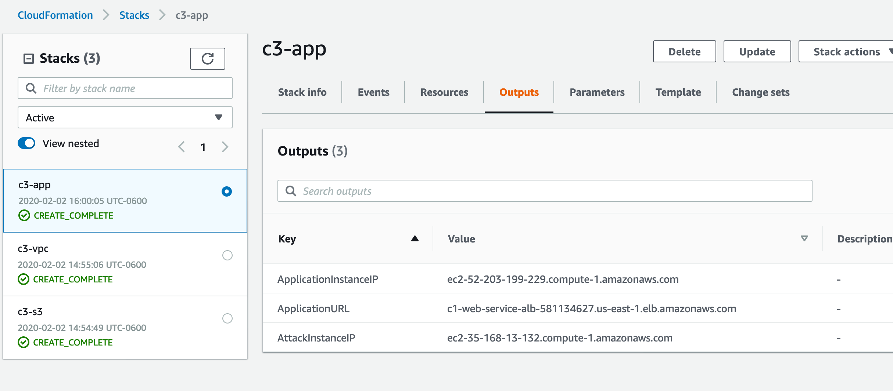
 
#### 3.  Upload data to S3 buckets
Upload the free recipes to the free recipe S3 bucket from step 2. Do this by typing this command into the console (you will replace `<BucketNameRecipesFree>` with your bucket name):
 
Example:  
```
aws s3 cp free_recipe.txt s3://<BucketNameRecipesFree>/ --region us-east-1
```
 
Upload the secret recipes to the secret recipe S3 bucket from step 2. Do this by typing this command into the console (you will replace `<BucketNameRecipesSecret>` with your bucket name):
 
Example:  
```
aws s3 cp secret_recipe.txt s3://<BucketNameRecipesSecret>/ --region us-east-1
```
 
#### 4. Test the application
Invoke the web service using the application load balancer URL:
```
http://<ApplicationURL>/free_recipe
```
You should receive a recipe for banana bread.

The AMIs specified in the cloud formation template exist in the us-east-1 (N. Virginia) region. You will need to set this as your default region when deploying resources for this project.
 
### Task 4:  Identify Bad Practices
 
Based on the architecture diagram, and the steps you have taken so far to upload data and access the application web service, identify at least 2 obvious poor practices as it relates to security. List these 2 practices, and a justification for your choices, in the text file named E1T4.txt.
 
**Deliverables:** 
- **E1T4.txt** - Text file identifying 2 poor security practices with justification.  
 [E1T4.txt](./starter/E1T4.txt)
## Exercise 2: Enable Security Monitoring
 
**_Deliverables for Exercise 2:_**
- **E2T2_config.png** - Screenshot of AWS Config showing non-compliant rules.
- **E2T2_inspector.png** - Screenshot of AWS Inspector showing scan results.
- **E2T2.png_securityhub.png** - Screenshot of AWS Security Hub showing compliance standards for CIS foundations.
- **E2T2.txt** - Provide recommendations on how to remediate the vulnerabilities.
 
### Task 1: Enable Security Monitoring using AWS Native Tools
 
First, we will set up security monitoring to ensure that the AWS account and environment configuration is in compliance with the CIS standards for cloud security.
 
#### 1. Enable AWS Config (skip this step if you already have it enabled)  
 a. See below screenshot for the initial settings.   
 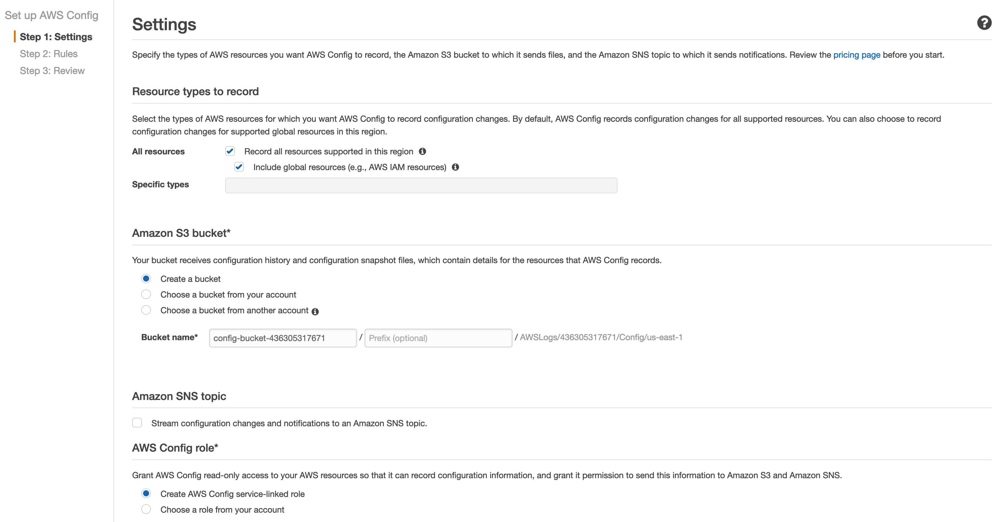  
 b. On the Rules page, click **Skip**.  
 c. On the Review page, click **Confirm**.
#### 2. Enable AWS Security Hub
 a. From the Security Hub landing page, click **Go To Security Hub**.  
b. On the next page, click **Enable Security Hub**
#### 3. Enable AWS Inspector scan
 a. From the Inspector service landing page, leave the defaults and click **Advanced**.  
 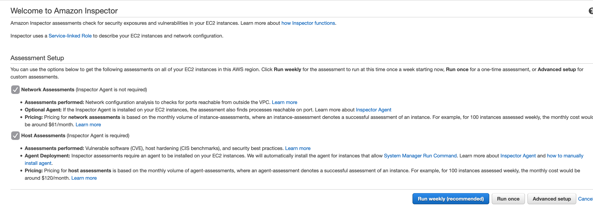  
 b. Uncheck **All Instances** and **Install Agents**.  
 c. Choose Name for Key and ‘Web Services Instance - C3’ for value, click **Next**.  
   
 d. Edit the rules packages as seen in the screenshot below.  
   
 e. Uncheck **Assessment Schedule**.  
 f. Set a duration of 15 minutes.
 g. Click **Next** and **Create**.
#### 4. Enable AWS Guard Duty
a. After 1-2 hours, data will populate in these tools giving you a glimpse of security vulnerabilities in your environment.
 
### Task 2: Identify and Triage Vulnerabilities
 
Please submit screenshots of:
- AWS Config - showing non-compliant rules
- AWS Inspector - showing scan results
- AWS Security Hub - showing compliance standards for CIS foundations.
 
Name the files E2T2_config.png, E2T2_inspector.png, E2T2_securityhub.png respectively.
 
Research and analyze which of the vulnerabilities appear to be related to the code that was deployed for the environment in this project. Provide recommendations on how to remediate the vulnerabilities. Submit your findings in E2T2.txt
 
**Deliverables:** 
- **E2T2_config.png** - Screenshot of AWS Config showing non-compliant rules.
  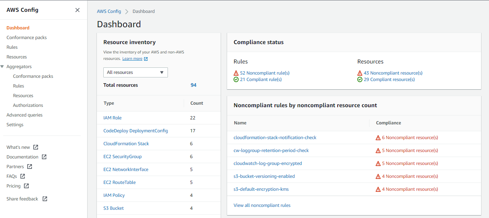
- **E2T2_inspector.png** - Screenshot of AWS Inspector showing scan results.
  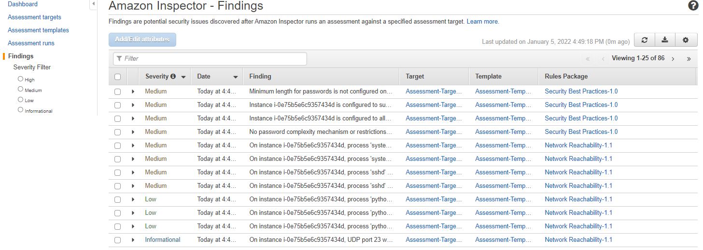 
  


- **E2T2.png_securityhub.png** - Screenshot of AWS Security Hub showing compliance standards for CIS foundations.
- 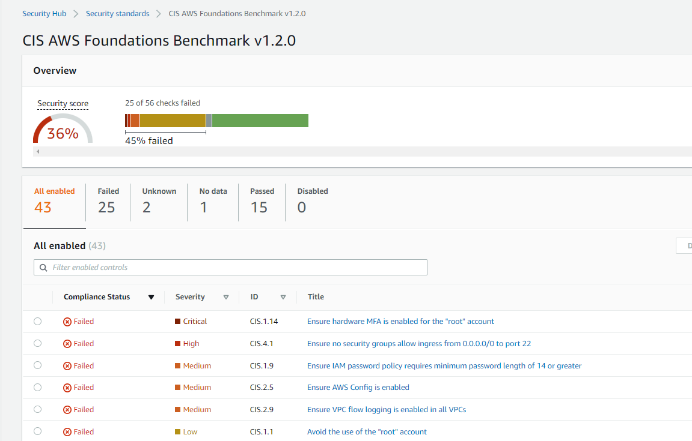
- **E2T2.txt** - Provide recommen
-  [E2T2.txt](./starter/E2T2.txt)
- dations on how to remediate the vulnerabilities.
 
## Exercise 3 - Attack Simulation
 
Now you will run scripts that will simulate the following attack conditions:
Making an SSH connection to the application server using brute force password cracking.
Capturing secret recipe files from the s3 bucket using stolen API keys.
 
**_Deliverables for Exercise 3:_**
- **E3T1_guardduty.png** - Screenshot of Guard Duty findings specific to the Exercise 3, Task 1 attack.

- **E3T1.txt** - Answer to the questions at the end of Exercise 3, Task 1.  

- **E3T2_s3breach.png** - Screenshot showing the resulting breach after the brute force attack.
  
- _Optional_ **Task 3** - Screenshots showing attack attempts and monitoring or logs from the WAF showing blocked attempts.
 
### Task 1: Brute force attack to exploit SSH ports facing the internet and an insecure configuration on the server

```
ssh -i <your private key file> ubuntu@<AttackInstanceIP>
```
The above instructions are for macOS X users.  For further guidance and other options to connet to the EC2 instance refer to [this guide](https://docs.aws.amazon.com/AWSEC2/latest/UserGuide/AccessingInstancesLinux.html)
 
#### 1. Log in to the attack simulation server using your SSH key pair.
#### 2. Run the below commands to start a brute force attack against the application server.  You will need the application server hostname for this.
```
date
hydra -l ubuntu -P rockyou.txt ssh://<YourApplicationServerDnsNameHere>
```
 
You should see output similar to the following:
		

 
Wait 10 - 15 minutes and check AWS Guard Duty.
 
#### 3. Answer the following questions:
1. What findings were detected related to the brute force attack?
2. Take a screenshot of the Guard Duty findings specific to the attack. Title this screenshot E3T1_guardduty.png.
3. Research the AWS Guard Duty documentation page and explain how GuardDuty may have detected this attack - i.e. what was its source of information?
 
Submit text answers in E3T1.txt.
 
**Deliverables:**
- **E3T1_guardduty.png** - Screenshot of Guard Duty findings specific to the Exercise 3, Task 1 attack.  
  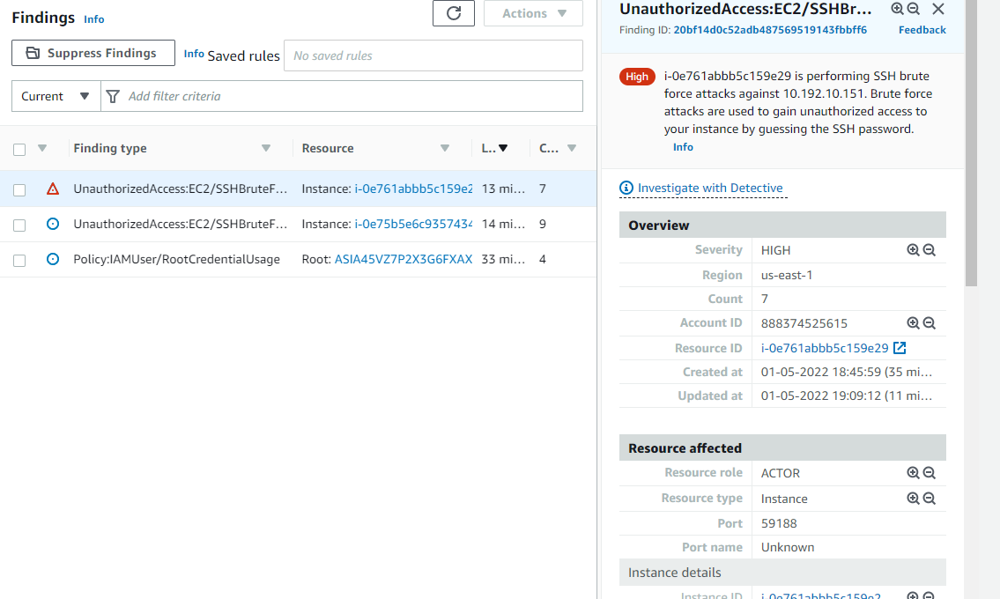  
- **E3T1.txt** - Answer to the questions at the end of Exercise 3, Task 1.  
 [E3T1txt](./starter/E3T1.txt)
### Task 2: Accessing Secret Recipe Data File from S3
 
Imagine a scenario where API keys used by the application server to read data from S3 were discovered and stolen by the brute force attack.  This provides the attack instance the same API privileges as the application instance.  We can test this scenario by attempting to use the API to read data from the secrets S3 bucket.
 
#### 1. Run the following API calls to view and download files from the secret recipes S3 bucket.  You will need the name of the S3 bucket for this.
 
```
# view the files in the secret recipes bucket
aws s3 ls  s3://<BucketNameRecipesSecret>/ --region us-east-1
 
# download the files
aws s3 cp s3://<BucketNameRecipesSecret>/secret_recipe.txt  .  --region us-east-1

# view contents of the file
cat secret_recipe.txt
```
Take a screenshot showing the breach:
E3T2_s3breach.png

_Optional Stand Out Suggestion_ Task 3:
Choose one of the application vulnerability attacks outlined in the OWASP top 10 (e.g. SQL injection, cross-site scripting)
Attempt to invoke the application using the ALB URL with a corrupt or malicious URL payload.
Setup the AWS WAF in front of the ALB URL.
Repeat the malicious URL attempts
Observe the WAF blocking these requests.
Submit screenshots of your attempts and monitoring or logs from the WAF showing the blocked attempts.

**Deliverables:**
- **E3T2_s3breach.png** - Screenshot showing the resulting breach after the brute force attack.  
  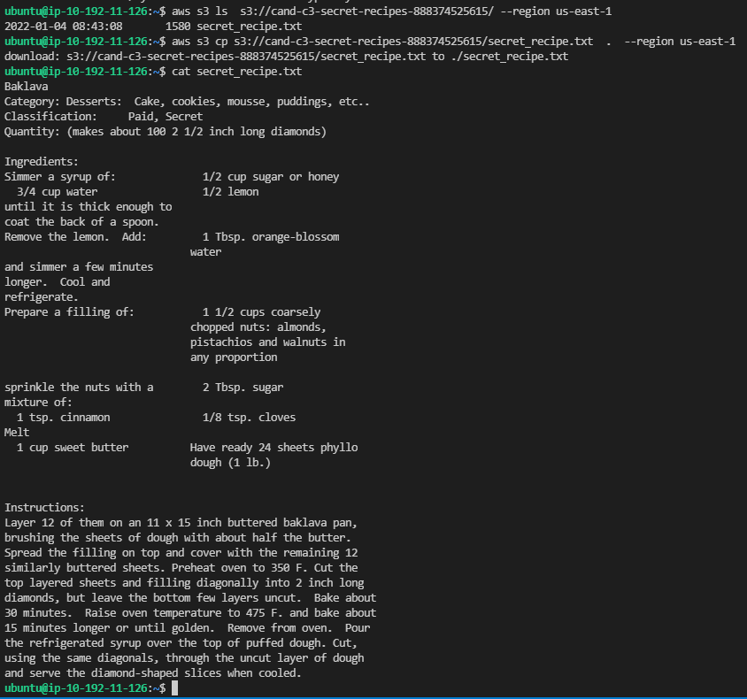
- _Optional_ **Task 3** - Screenshots showing attack attempts and monitoring or logs from the WAF showing blocked attempts.

## Exercise 4 - Implement Security Hardening

**_Deliverables for Exercise 4:_**
- **E4T1.txt** - Answer to the prompts in Exercise 4, Task 1.
- **E4T2_sshbruteforce.png** - Screenshot of terminal window showing the brute force attack and the remediation.
- **E4T2_networksg.png** - Screenshot of the security group change. 
- **E4T2_sshattempt.png** - Screenshot of your SSH attempt.
- **E4T2_s3iampolicy.png** - Screenshot of the updated IAM policy.
- **E4T2_s3copy.png** - Screenshot of the failed copy attempt.
- **E4T2_s3encryption.png** - screenshot of the S3 bucket policy
- **E4T3_securityhub.png** - Screenshot of Security Hub after reevaluating the number of findings.
- **E4T3_config.png** - Screenshot of Config after reevaluating the number of findings.
- **E4T3_inspector.png** - Screenshot of Inspector after reevaluating the number of findings.
- **E4T4.txt** - Answers from prompts in Exercise 4, Task 4.
- _Optional_ **c3-app_solution.yml** and **c3-s3_solution.yml** - Updated cloud formation templates which reflect changes made in E4 tasks related to AWS configuration changes.
- _Optional_ **E4T5.txt** - Additional hardening suggestions from Exercise 4, Task 5.

### Task 1 - Remediation plan

As a Cloud Architect, you have been asked to apply security best practices to the environment so that it can withstand attacks and be more secure.
1. Identify 2-3 changes that can be made to our environment to prevent an SSH brute force attack from the internet.
2. Neither instance should have had access to the secret recipes bucket; even in the instance that API credentials were compromised how could we have prevented access to sensitive data?

Submit answer in E4T1.txt

**Deliverables:**
- **E4T1.txt** - Answer to the prompts in Exercise 4, Task 1.  
  [E4T1txt](./starter/E4T1.txt)

### Task 2 - Hardening

#### Remove SSH Vulnerability on the Application Instance

1. To disable SSH password login on the application server instance.

```
# open the file /etc/ssh/sshd_config
sudo vi /etc/ssh/sshd_config

# Find this line:
PasswordAuthentication yes

# change it to:
PasswordAuthentication no

# save and exit

#restart SSH server
sudo service ssh restart
```
2. Test that this made a difference.  Run the brute force attack again from Exercise 3, Task 1.  

3. Take a screenshot of the terminal window where you ran the attack highlighting the remediation and name it E4T2_sshbruteforce.png.

**Deliverables:**
- **E4T2_sshbruteforce.png** - Screenshot of terminal window showing the brute force attack and the remediation.
  
  

#### Apply Network Controls to Restrict Application Server Traffic

1. Update the security group which is assigned to the web application instance.  The requirement is that we only allow connections to port 5000 from the public subnet where the application load balancer resides.
2. Test that the change worked by attempting to make an SSH connection to the web application instance using its public URL.
3. Submit a screenshot of the security group change and your SSH attempt.

**Deliverables**:
- **E4T2_networksg.png** - Screenshot of the security group change.   
  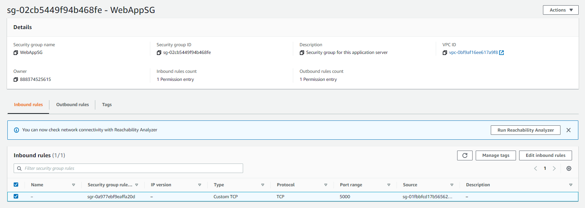
  

- **E4T2_sshattempt.png** - Screenshot of your SSH attempt.  
  
#### Least Privilege Access to S3  

1. Update the IAM policy for the instance profile role used by the web application instance to only allow read access to the free recipes S3 bucket.
2. Test the change by using the attack instance to attempt to copy the secret recipes.
3. Submit a screenshot of the updated IAM policy and the attempt to copy the files. 

**Deliverables:**
- **E4T2_s3iampolicy.png** - Screenshot of the updated IAM policy.
  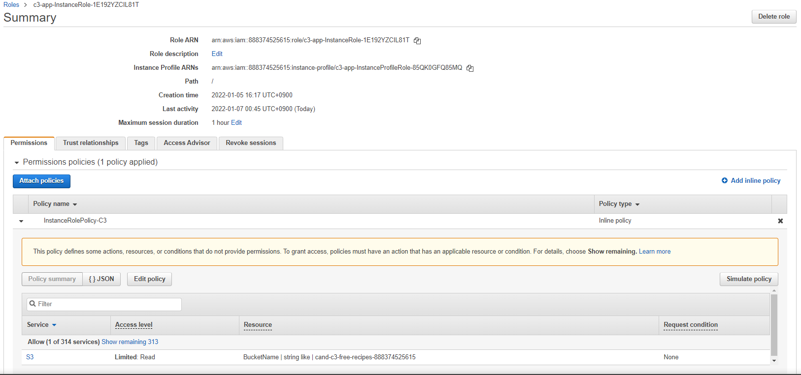    
- **E4T2_s3copy.png** - Screenshot of the failed copy attempt.  
    
#### Apply Default Server-side Encryption to the S3 Bucket

This will cause the S3 service to encrypt any objects that are stored going forward by default.
Use the below guide to enable this on both S3 buckets.   
[Amazon S3 Default Encryption for S3 Buckets](https://docs.aws.amazon.com/AmazonS3/latest/dev/bucket-encryption.html)

Capture the screenshot of the secret recipes bucket showing that default encryption has been enabled.

**Deliverables**:
- **E4T2_s3encryption.png** - Screenshot of the S3 bucket policy.
  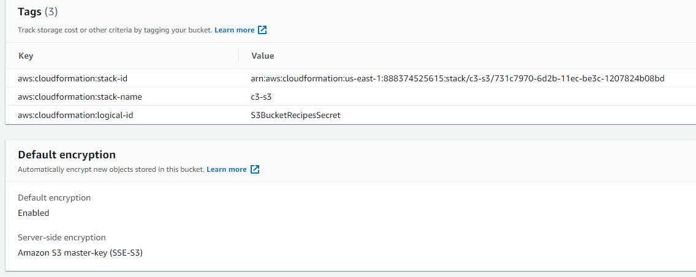

### Task 3: Check Monitoring Tools to see if the Changes that were made have Reduced the Number of Findings

1. Go to AWS inspector and run the inspector scan that was run in Exercise 2.
2. After 20-30 mins - check Security Hub to see if the finding count reduced.
3. Check AWS Config rules to see if any of the rules are now in compliance.
4. Submit screenshots of Inspector, Security Hub, and AWS Config titled E4T3_inspector.png, E4T3_securityhub.png, and E4T3_config.png respectively.

**Deliverables**:
- **E4T3_securityhub.png** - Screenshot of Security Hub after reevaluating the number of findings.
 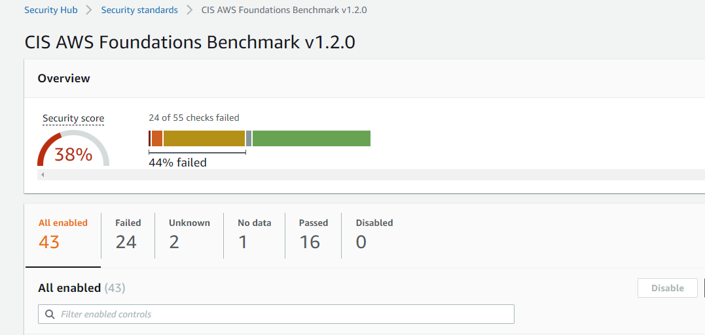
- **E4T3_config.png** - Screenshot of Config after reevaluating the number of findings.
  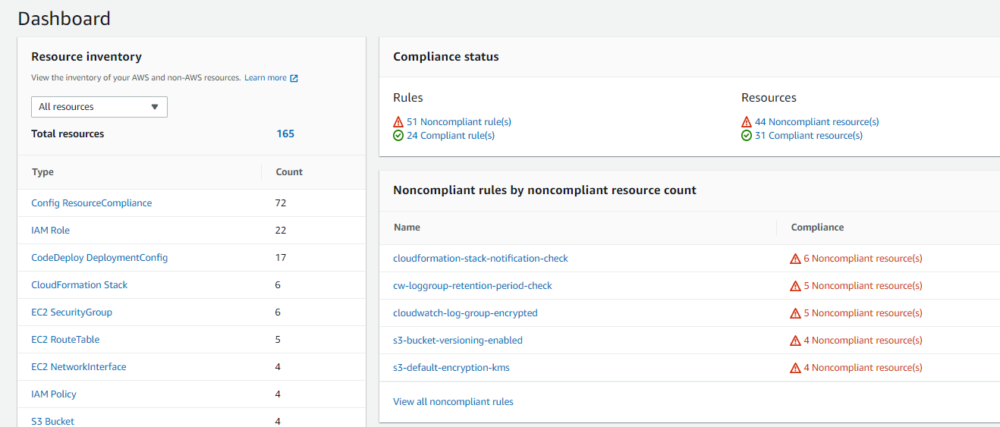
- **E4T3_inspector.png** - Screenshot of Inspector after reevaluating the number of findings.
 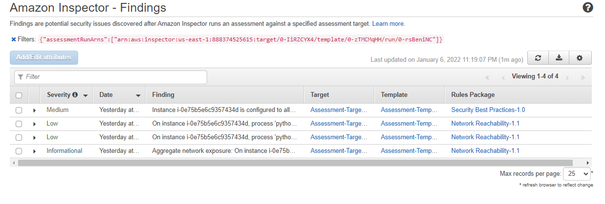


### Task 4: Questions and Analysis

1. What additional architectural change can be made to reduce the internet-facing attack surface of the web application instance.
2. Assuming the IAM permissions for the S3 bucket are still insecure, would creating VPC private endpoints for S3 prevent the unauthorized access to the secrets bucket.
3. Will applying default encryption setting to the s3 buckets encrypt the data that already exists?
4. The changes you made above were done through the console or CLI; describe the outcome if the original cloud formation templates are applied to this environment?

Submit your answers in E4T4.txt.

**Deliverables**:
- **E4T4.txt** - Answers from prompts in Exercise 4, Task 4.  
  [E4T4txt](./starter/E4T4.txt)

###  _Optional Standout Suggestion_ Task 5 - Additional Hardening

Make changes to the environment by updating the cloud formation template. You would do this by copying c3-app.yml and c3-s3.yml and putting your new code into c3-app_solution.yml and c3-s3_solution.yml.
Brainstorm and list additional hardening suggestions aside from those implemented that would protect the data in this environment. Submit your answers in E4T5.txt.

**Deliverables**:
- _Optional_ **c3-app_solution.yml** and **c3-s3_solution.yml** - updated cloud formation templates which reflect changes made in E4 tasks related to AWS configuration changes.
- _Optional_ **E4T5.txt** - Additional hardening suggestions from Exercise 4, Task 5.

## Exercise 5 - Designing a DevSecOps Pipeline

Take a look at a very common deployment pipeline diagrammed below:


The high-level steps are as follows:

1. The user makes a change to the application code or OS configuration for a service.
2. Once the change is committed to source, a build is kicked off resulting in an AMI or a container image.
3. The infrastructure as code is updated with the new AMI or container image to use.
4. Changes to cloud configuration or infrastructure as code may have also been committed.
5. A deployment to the environment ensues applying the changes

**_Deliverables for Exercise 5:_**
- **DevSecOpsPipline.[ppt or png]** - Your updated pipeline.
- **E5T2.txt** - Answer from prompts in Exercise 5, Task 2.
- *Optional* **E5T3.png** - Screenshot of tool that has identified bad practices.
- *Optional* **E5T3.txt** - Answers from prompts in Exercise 5, Task 3.

### Task 1:  Design a DevSecOps pipeline

Update the starter DevOpsPipeline.ppt (or create your own diagram using a different tool)
At minimum you will include steps for:
- Infrastructure as code compliance scanning.
- AMI or container image scanning.
- Post-deployment compliance scanning.

Submit your design as a ppt or png image named DevSecOpsPipeline.[ppt or png].

**Deliverables**:
- **DevSecOpsPipline.[ppt or png]** - Your updated pipeline.  
  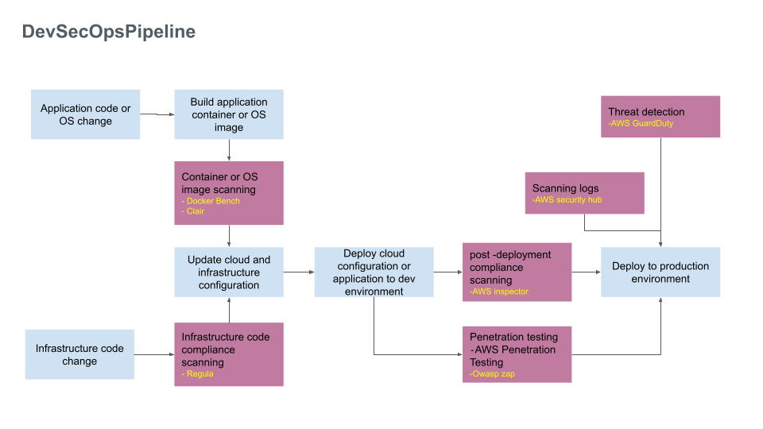
  

### Task 2 - Tools and Documentation
      
You will need to determine appropriate tools to incorporate into the pipeline to ensure that security vulnerabilities are found.

1. Identify tools that will allow you to do the following:
 a. Scan infrastructure as code templates.
 b. Scan AMI’s or containers for OS vulnerabilities.
 c. Scan an AWS environment for cloud configuration vulnerabilities.
2. For each tool - identify an example compliance violation or vulnerability which it might expose.

Submit your answers in E5T2.txt

**Deliverables**:
- **E5T2.txt** - Answer from prompts in Exercise 5, Task 2.  
  [E5T2.txt](./starter/E5T2.txt)


### _Optional Standout Suggestion_ Task 3 - Scanning Infrastructure Code

- Run an infrastructure as code scanning tool on the cloud formation templates provided in the starter.
- Take a screenshot of the tool that has correctly identified bad practices.
- If you had completed the remediations by updating the cloud formation templates, run the scanner and compare outputs showing that insecure configurations were fixed.

**Deliverables**:
- _Optional_ **E5T3.png** - Screenshot of tool that has identified bad practices.
- _Optional_ **E5T3.txt** - Answers from prompts in Exercise 5, Task 3.

## Exercise 6 - Clean up 

Once your project has been submitted and reviewed - to prevent undesired charges don’t forget to: 
- Disable Security Hub and Guard Duty.
- Delete recipe files uploaded to the S3 buckets.
- Delete your cloud formation stacks.

## _Optional Standout Suggestion_ Exercise 7 - Enjoying the Spoils of Your Good Security Work!

Bake one of the desserts from the recipe text files and submit a picture. :-)

